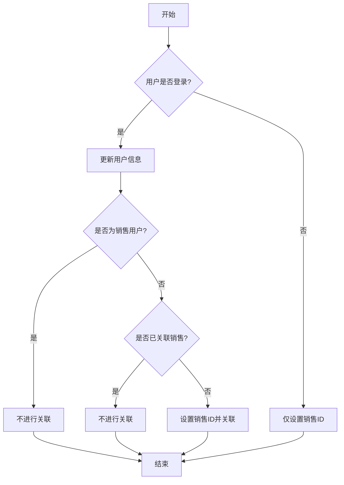

```mermaid
graph TD
    A[开始] --> B{用户是否登录?}
    B -->|是| C[更新用户信息]
    C --> D{是否为销售用户?}
    D -->|是| E[不进行关联]
    D -->|否| F{是否已关联销售?}
    F -->|是| G[不进行关联]
    F -->|否| H[设置销售ID并关联]
    B -->|否| I[仅设置销售ID]
    E --> J[结束]
    G --> J
    H --> J
    I --> J
```
