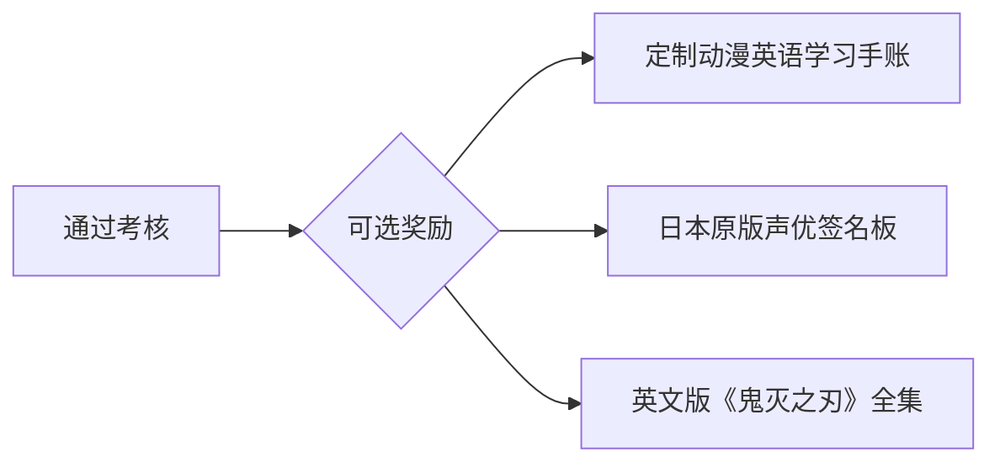

# 一、任务
### 📅 每日基础任务（60分钟｜日历打卡｜奖惩）

#### **💡 日历打卡记录学习时间**

| 时间段         | 任务     | 具体操作                                          | 完成标准✅             | 奖惩机制                  |
| ----------- | ------ | --------------------------------------------- | ----------------- | --------------------- |
| **晨间15min** | 歌曲语法挖掘 | 1. 跟唱1首歌 2. 圈出1个语法点（时态/从句） 3. 仿写1句      | 笔记发推特#SongGrammar | ✔️存10元漫展基金 ❌晨跑+1km |
| **午间10min** | 病句捉虫   | 改错APP完成5题 （错题收藏至"语法医院"）                    | 正确率≥80%           | ✔️午休+10min ❌喝苦瓜汁   |
| **通勤15min** | 盲听特训   | 听《阿甘妙世界》音频 记录3个介词搭配（如on the bus）           | 备忘录截图             | ✔️买小零食 ❌次日双倍任务     |
| **晚间15min** | 动漫实战   | 1. 配音1段（≥70分） 2. 用当日语法点改台词 （例：把现在时改过去时） | 系统评分+改编截图         | ✔️游戏30min ❌打扫房间    |
| **睡前5min**  | 词汇巩固   | Anki刷10词（含例句音频）                               | 显示"今日完成"          | ✔️追更1话漫画 ❌背双倍      |

### 🎁 升级任务（选做）

- **歌曲党专属**：每周完成1次歌词默写（错≤3处可兑换奶茶券）  
- **动漫党专属**：每月配音1个片段发朋友圈（获10赞免1天任务）  

### 💡 **简单原则**

>- **最小执行量**：  
  即使某天只完成1项，也必须：  
  ✅ 跟读1分钟动漫台词  
  ✅ 听1遍当日歌曲  
- **补卡规则**：  
  每周日可补做2天遗漏任务（需额外完成惩罚任务）
---

# 二、关键工具包

| 用途   | 推荐工具                                                                                             | 使用技巧            |
| ---- | ------------------------------------------------------------------------------------------------ | --------------- |
| 听力   | 1、App：每日英语听力 2、App：网易云音乐"英语教材歌单"                                                              | 歌词解析 长按歌词看翻译 |
| 口语   | 1、App：每日英语听力 2、AI对话练习：咕噜英语App（698终身会员）、Siri对话 3、看英文动漫-《汪汪队》、《间谍过家家》 4、App：英语流利说"动漫台词"课程 | 模仿角色语气          |
| 阅读   | 1、动漫网站-英文阅读                                                                                      | 精读              |
| 单词   | 1、百词斩"动漫高频词"书 2、Anki卡片记忆                                                                      |                 |
| 进度追踪 | 手机日历打卡                                                                                           | 每天✅/❌标记         |

# 三、奖惩
### 🏆 奖惩系统 💣

| 达成条件      | 奖励          | 惩罚                                            | 升级挑战（可选） |
| --------- | ----------- | --------------------------------------------- | -------- |
| 每天满30min✅ | 解锁一部漫画      | 7点起床                                          | 无        |
| 每周满5天✅    | 一个拼装玩具      | 一周不能看漫画                                       | 盲听无字幕版   |
| 每月满25天✅   | 动漫周边（≤200元） | 一个月不能刷视频，若完成少于20天，则删除一个漫画软件（强调-**删了就没资源下载了**） | 录制双语配音作品 |
| 季度满75天✅   | 看一场演唱会      | 不能去付费景点游玩                                     | 无        |
| 半年度满150天✅ | 一次长途旅游      | 捐200元公益基金                                     | 无        |

###  惩罚执行规则

**立即执行，不可拖延，用户积分**

---

# 四、 终极检验方案（6个月末）
### 📌毕业考试包
1. **听力**：看《进击的巨人》生肉片段（2分钟）→ 写英文剧情报告  
2. **口语**：用兵长声线翻唱《Enemy》（副歌部分）  
3. **语法**：修改粉丝同人小说中的10处错误  
4. **词汇**：直播解说《原神》英服副本（15分钟）  

### 2. 强化效果检验
| 周期  | 检验方式          | 通过标准       |
| --- | ------------- | ---------- |
| 每周  | 录制《咱们裸熊》1分钟配音 | 自我感觉比上周更流畅 |
| 每月  | 盲听新番片段（1分钟）   | 听懂关键词≥5个   |
| 季度  | 翻唱整首英文歌       | 全民K歌评分≥85  |

### 成就奖励

> 🔥 **执行口诀**：  
> 早晨挖语法 → 中午捉病句 → 通勤磨耳朵 → 晚上玩配音  
> 每周小奖励 → 月月大进步 → 半年见真章

**数据验证**：每日有效学习57分钟 × 180天 = 171小时 → 超出口语流利阈值150小时（剑桥ESL研究）