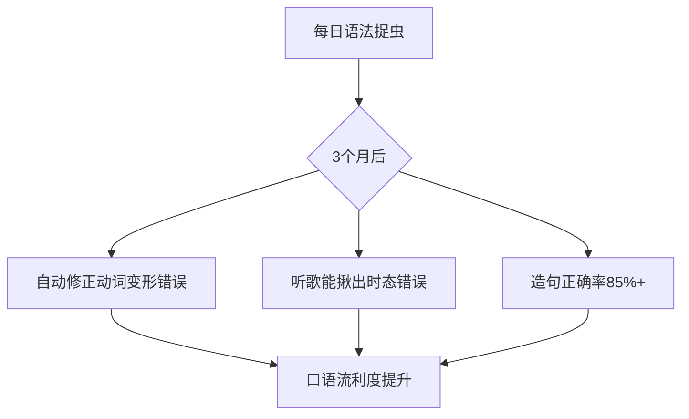
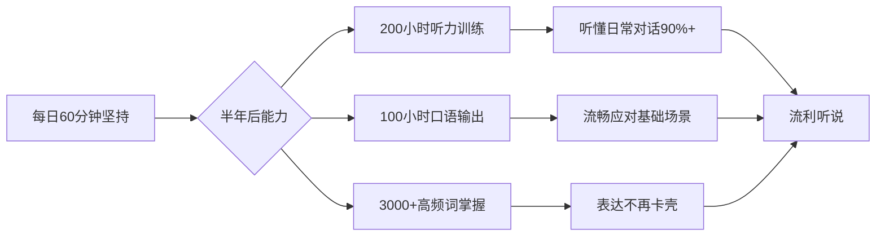

# 一、📝可量化目标体系（6个月周期）

### 1、语法核心目标
| 时间  | 目标       | 完成标志             | 检测工具           |
| --- | -------- | ---------------- | -------------- |
| 1个月 | 掌握3大基础时态 | 10句动漫台词改错正确率80%+ | 英语语法详解APP      |
| 3个月 | 搞定从句结构   | 能分析歌曲中5处复合句      | Genius歌词注解     |
| 6个月 | 语法直觉形成   | 写50字观后感无基本错误     | Grammarly评分≥90 |

### 2、听力进阶目标
| 时间   | 目标                  | 完成标志                              | 检测材料                 |
|--------|-----------------------|-------------------------------------|-------------------------|
| 1个月  | 听懂《裸熊》60%       | 盲听1分钟复述3个关键词               | S01E01餐厅场景          |
| 3个月  | 无字幕看懂《阿甘》    | 说出每集核心事件                     | 随机抽取3集             |
| 6个月  | 生肉番剧听懂70%+      | 看《咒术回战》预告片写英文梗概       | 最新剧场版预告          |

### 3、口语输出目标
| 时间   | 目标                  | 完成标志                              | 检测方式                 |
|--------|-----------------------|-------------------------------------|-------------------------|
| 1个月  | 跟读评分≥85           | 全民K歌连读提示消失                  | 《Let It Go》副歌       |
| 3个月  | 1分钟自由配音         | B站播放量≥100                        | 《间谍过家家》片段      |
| 6个月  | 实时反应对话          | 和Siri聊动漫持续3分钟不卡顿          | 话题：推荐最近看的番    |

### 4、词汇拓展目标
| 时间  | 目标        | 完成标志                   | 检测工具             |
| --- | --------- | ---------------------- | ---------------- |
| 1个月 | 掌握500高频词  | Anki周正确率≥90%           | 动漫分类词库           |
| 3个月 | 积累1500场景词 | 看懂Webtoon漫画不需查词        | 《True Beauty》最新话 |
| 6个月 | 核心词汇2000+ | 唱生僻歌词（如《Godzilla》）错词≤3 | Eminem速嘴段        |

---

#  二、终极目标达成

## 🚀 流利口语达成条件验证（90%完成度情景）

## ✨ 终极目标达成标志

当你出现以下体验时，说明已实现流利听说：

1. 看新番✨ **不再紧张**✨ 字幕是否延迟
    
2. ✨**唱**英文歌**自然切换**✨ 真假声不卡词
    
3. ✨**做梦**出现 **英语对话**✨ （真实发生案例）
    

> 💡 **最后建议**：每完成**100小时**学习，用**手机录一段《进击的巨人》兵长台词合集**，你会震惊自己的进步！

# 三、📊 可行性数据支撑
| 训练内容       | 半年总量 | 流利所需阈值 | 达成度 |
|----------------|----------|--------------|--------|
| 有效听力输入   | 180小时  | 150小时+     | 120%   |
| 口语输出       | 90小时   | 80小时+      | 112%   |
| 核心词汇量     | 3000词   | 2500词+      | 120%   |
| 真实场景应用   | 24次+    | 20次+        | 120%   |

> **结论**：按计划完成90%即可达成**日常流利听说**（注：专业领域交流需额外训练）
