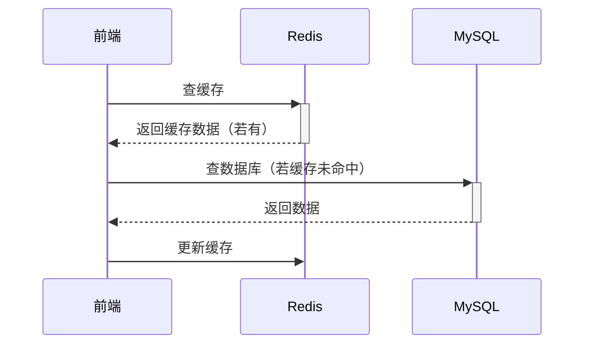

## 一、数据库类型选择指南

### 1. 关系型 vs 非关系型

| 特性                | 关系型 (MySQL)               | 非关系型 (MongoDB)            | 前端类比                 |
|---------------------|-----------------------------|------------------------------|------------------------|
| **数据结构**        | 表格（行和列）              | JSON文档/键值对              | Excel vs JS对象        |
| **使用场景**        | 需要严格结构的数据          | 灵活多变的非结构化数据        | 用户账户 vs 用户行为日志|
| **查询复杂度**      | 适合复杂关联查询            | 适合简单快速查询              | 多表关联 vs 单文档读取  |
| **扩展方式**        | 垂直扩展（升级配置）        | 水平扩展（增加服务器）        | 换更贵电脑 vs 加服务器 |

### 2. 什么时候用哪种？
- **选关系型**当：
  - 需要事务（如支付系统）
  - 数据结构稳定不变
  - 需要复杂报表

- **选非关系型**当：
  - 数据结构经常变化
  - 需要快速开发迭代
  - 数据量增长极快

## 二、核心概念速查

### 1. 基本操作（CRUD）

| 操作 | SQL示例               | MongoDB示例                  | 前端类比              |
|------|-----------------------|-----------------------------|---------------------|
| 创建 | `INSERT INTO users...`| `db.users.insert({...})`    | `array.push()`      |
| 读取 | `SELECT * FROM users` | `db.users.find({})`         | `array.filter()`    |
| 更新 | `UPDATE users SET...` | `db.users.update({...})`    | `array[index]=...`  |
| 删除 | `DELETE FROM users`   | `db.users.remove({...})`    | `array.splice()`    |

### 2. 索引原理
- **就像书本目录**：加快查找速度但增加"书"的厚度
- **创建索引**：
  ```sql
  -- MySQL
  CREATE INDEX idx_name ON users(name);
  
  -- MongoDB
  db.users.createIndex({ name: 1 });
  ```

### 3. 事务特性（ACID）
- **原子性**：操作要么全成功要么全失败
- **一致性**：数据始终保持合法状态
- **隔离性**：多个事务互不干扰
- **持久性**：提交后永久保存

## 三、缓存使用策略

### 1. 缓存位置选择

| 缓存类型 | 特点                  | 前端类比              | 适用场景             |
|---------|-----------------------|---------------------|--------------------|
| Redis   | 内存存储，超快         | `useMemo`全局版      | 会话、热点数据       |
| 文件缓存 | 简单但较慢            | `localStorage`      | 开发环境/小型应用    |
| 数据库   | 持久但性能一般         | IndexedDB           | 备用缓存方案         |

### 2. 经典缓存模式


## 四、实用场景速查

### 1. 电商系统典型设计
- **MySQL**存：用户信息、订单、商品详情
- **Redis**存：购物车、秒杀库存、会话
- **MongoDB**存：商品评论、用户行为日志

### 2. 社交平台典型设计
- **MySQL**存：用户关系、私信
- **Redis**存：粉丝列表、点赞状态
- **图数据库**存：好友推荐关系

## 五、常见误区提醒

1. **不要过度使用JOIN**  
   就像前端避免过度嵌套组件，考虑多次简单查询替代复杂JOIN

2. **非关系型不是完全没结构**  
   就像JS对象虽然灵活但最好保持一定约定

3. **缓存不是万能的**  
   要处理缓存穿透、雪崩、击穿问题（类似前端处理loading状态）

---

> 保存提示：建议将此文档保存为`数据库速查.md`，需要时可快速查阅。实际开发中，80%的场景用20%的这些知识就能解决！